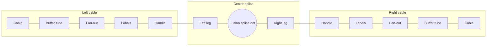
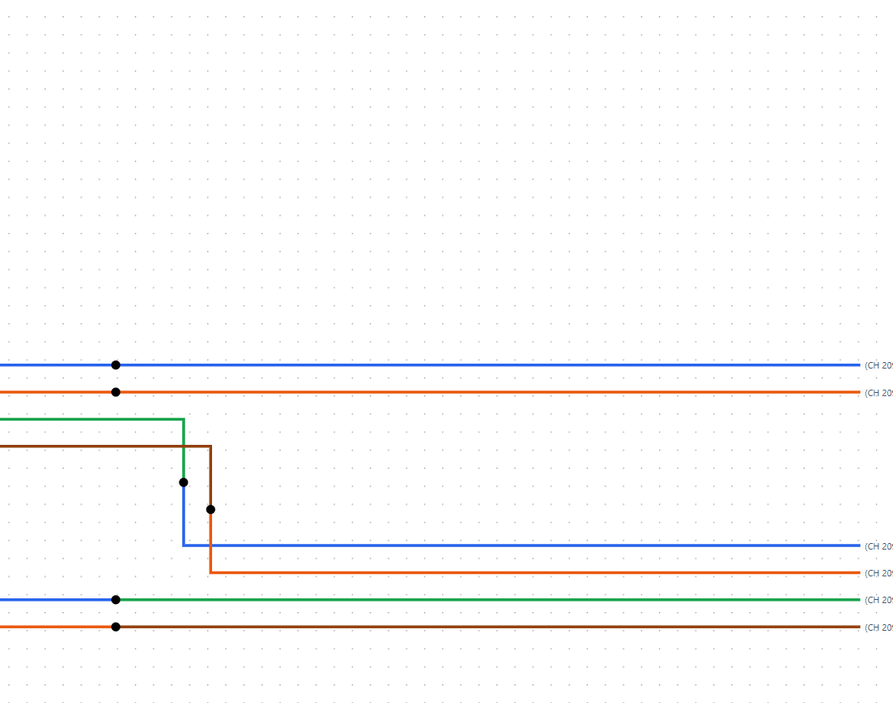
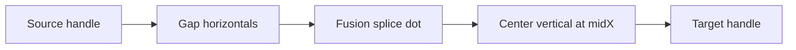

# Canvas component glossary

> **Use this when talking to agents.** Say “the cable sheath” or “fusion splice dot” and we mean the same UI piece.  
> Screenshots are from **live app** after importing a reference CSV (see `docs/reference/examples/README.md`).

## Simple map — start here

**Speak in simple terms:** [`SIMPLE_TERMS.md`](./SIMPLE_TERMS.md) — one-line diagram + user ↔ agent dictionary.

The diagram has **three parts**: **left cable** · **center splice** · **right cable** (mirrored names on each side).

### One-line diagram (left → right)

**Cable → buffer tube → fan-out → labels → handle → left leg → fusion splice dot → right leg → handle → labels → fan-out → buffer tube → cable**



| Part | Names (outside → in on each cable) |
|------|-------------------------------------|
| **Left / right cable** | cable → buffer tube → fan-out → labels → handle |
| **Center splice** | left leg → fusion splice dot → right leg |

Left **handle** = **source**; right **handle** = **target**. Full mapping table: [`SIMPLE_TERMS.md`](./SIMPLE_TERMS.md).

For rule IDs and expanded part names, see [Detail reference](#detail-reference) below.

---

## Full diagram


Left = source cables. Center = splice lines + fusion dots. Right = target cables (mirror of left).

---

## Detail reference

The sections below expand the simple names (tube origin, stem column, midX, etc.) for agents and layout work.

### Big picture — five zones (left → right)

```mermaid
flowchart LR
  subgraph Z1 [Zone 1 — Cable edge]
    Stub[Cable stub]
    Sheath[Cable sheath]
    Titles[SMFO + cable name]
  end
  subgraph Z2 [Zone 2 — Tube breakout]
    Origin[Tube origin / sheath face]
    TubeStem[Buffer tube stem]
    FanZone[Fan zone + fan legs]
    TubeTip[Tube tip / fan junction]
  end
  subgraph Z3 [Zone 3 — Label column]
    TubeLabel[Tube label]
    FiberRow[Fiber row]
    Swatch[Fiber swatch]
    FiberCode[Fiber code]
    Circuit[Circuit tag]
    Handle[Fiber handle / stem column]
  end
  subgraph Z4 [Zone 4 — Splice routing]
    GapH[Gap horizontals]
    Dot[Fusion splice dot]
    Trunk[Bundle trunk jogX]
    MidX[Center lane midX]
    SplicePath[Splice path H-V-H]
  end
  subgraph Z5 [Zone 5 — Far cable]
    TargetHandle[Target fiber handle]
    TargetLabels[Target fiber label column]
    TargetTube[Target buffer tube]
    TargetSheath[Target cable sheath]
  end
  Z1 --> Z2 --> Z3 --> Z4 --> Z5
```

<details>
<summary>Optional — finer-grained zone breakdown (click to expand)</summary>



</details>

---

## Zone 1 — Cable (the “fiber cable”)

**What it is:** One **cable leg** in this diagram (not always one physical cable — ring-cut can show two legs for one name).


| What you see | Official name | Code / data |
|--------------|---------------|-------------|
| Whole graphic for one cable leg | **Cable node** | React Flow `node` type `cable` |
| Rounded body / circle on the outside | **Cable sheath** | `computeCableBreakout`, `computeSheathSize` |
| Top line, e.g. `006 SMFO (R2)` | **SMFO label** | `CableNodeData.smfoLabel` |
| Second line, e.g. `6 DROP (SC)…` | **Cable name** | `CableNodeData.label` |
| Short horizontal from sheath toward canvas edge | **Cable stub** | Part of cable node SVG |
| Left or right placement | **Side** | `CableNodeData.side` — `left` = source; `right` = target |
| Red editable annotation (toolbar) | **Cable callout** | `LayoutOverrides.callouts` — optional |

**Say:** “**Cable node** on the left” — not “fiber cable box” (**cable sheath** is the round part only).

**Related rules:** CBL-001–005

---

## Zone 2 — Buffer tube (both ends)

**What it is:** Thick **colored** line from sheath toward center — one per tube color group (BL, OR, GR, BR…).

### Sheath end (where tube meets the cable)

| What you see | Official name | Notes |
|--------------|---------------|-------|
| Where the thick tube line attaches to the sheath | **Tube origin** | Code: `tube.origin`; exits from **sheath face** (`tubeFaceX`) |
| Rule for angle at exit | **Tube exit from sheath** | **TUB-001** — horizontal when group fits on sheath face; fans from **cable center** when multi-tube |
| Dashed thick line | **Striped tube** | Tube codes ending in `-BK` (145–288 fiber) |

### Center end (where tube meets the fan-out)

| What you see | Official name | Notes |
|--------------|---------------|-------|
| End of thick line nearest labels | **Tube tip** | Aligned to fiber-group center (**TUB-002**) |
| Where tube + curved fibers meet | **Fan junction** / **fan-out origin** | Code: `fanFrom` |
| Space between tip and label stack | **Fan zone** | Curved **fan legs** fill this (`tubeFanInset`) |
| Bold tube color at junction, e.g. **BR** | **Tube label** | In the **fan crest**; CSS `.cable-node__tube-label` |
| Thick line body | **Tube stem** | Buffer tube segment from **tube origin** → **tube tip** |

**Say:** “**Tube origin** on the sheath” vs “**tube tip** at the fan” — two ends of the same **buffer tube**.

**Related rules:** TUB-001–008

---

## Zone 3 — Fiber strand breakout (per row)

**What it is:** Thin **colored lines** for one spliced fiber per row (only pairs in CSV are drawn).

Each spliced fiber gets one **fiber row** at **24px pitch** (**FBR-002**).

| What you see | Official name | Notes |
|--------------|---------------|-------|
| Curved thin colored lines tube → row | **Fan legs** | **Fan tail** (under tube) + **fan top** (stub + curve above) |
| Short horizontal before curve | **Fan stub** / **fan elbow** | Center row may stay straight |
| Colored dot on the row | **Fiber handle** | React Flow `Handle`; CSS `.cable-node__handle` |
| Vertical alignment of all handles | **Stem column** / **shared stem column** | Code: `stemX`; shared across cables on same side (**TUB-007**) |
| Small colored square | **Fiber swatch** | CSS `.cable-node__fiber-swatch` |
| **SL**, **WH**, **RD**… | **Fiber code** | Fiber **color abbreviation** (`FiberColorAbbrev`); CSS `.cable-node__fiber-code` |
| `(CH 2004)` etc. | **Circuit tag** | From CSV **circuit name** / Bentley **OS column**; CSS `.cable-node__circuit` |
| Swatch + code + circuit together | **Fiber label column** | Same X for all cables on that side |
| Thin horizontal at fixed row Y inside cable | **Strand line** (fan portion) | Breakout SVG; distinct from center **splice path** |

**Direction rule:** **STR-001** — left cables fan **right** toward center; right cables fan **left**.

**Related rules:** FBR-001–004, STR-001, TUB-007

---

## Zone 4 — Center splice routing {#detail--center-routing}

**What it is:** Center **routing line** connecting two fiber or collapsed tube handles — one **splice edge** per fiber pair.



### Endpoints — both sides of the strand

| Term | Meaning |
|------|---------|
| **Source handle** | Handle on the diagram-left endpoint (path starts here) |
| **Target handle** | Handle on the diagram-right endpoint (path ends here) |
| **Left leg** | Colored path from **source handle** → **fusion splice dot** (source fiber color) |
| **Right leg** | Colored path from **fusion splice dot** → **target handle** (target fiber color) |

On a left cable, the **fiber handle** is the **source**; on the right cable it is the **target** (for a left→right splice).

### Path anatomy and bends

Typical cross-side shape is **orthogonal H–V–H** (**EDGE-002**):



| What you see | Official name | Notes |
|--------------|---------------|-------|
| Whole routed line | **Splice path** | `buildSplicePath` / `SpliceEdge.tsx` |
| Horizontal run leaving handle, past labels | **Gap horizontals** | Must clear **OS / circuit column** + 60px inset (**EDGE-009**) |
| Small black dot on a horizontal | **Fusion splice dot** | **DOT-001** — not on the vertical center leg |
| Where left and right legs meet | **Fusion splice point** / **splice point** | Code: `spliceX`, `spliceY` |
| Vertical segment in the middle | **Center lane** / **center vertical** | Assigned **midX** — distinct per strand on import (**EDGE-001**) |
| Shared horizontal for same-tube → same-target fibers | **Bundle trunk** | Code: **jogX** (**EDGE-010**) |
| Shared X for dots from one source tube | **Dot column** | **DOT-002** |
| 90° turn in the path | **Bend** | Max **2 bends** total per splice (**EDGE-004**) |
| Horizontal on source row before vertical | **Source horizontal** | `sourceHorizY` / `sourceY` |
| Horizontal on target row after vertical | **Target horizontal** | `targetHorizY` / `targetY` |
| Open area between label columns | **Splice routing zone** / **gap** | Where lanes and trunks live |
| Vertical diagram midpoint | **Diagram center X** | Inward routing direction |

**When rows align (±12px):** path can be a straight **0-bend** line handle-to-handle.

**Same-side splices:** still orthogonal, route inward and back (**same_side** template).

**Related rules:** EDGE-001–012, DOT-001–002

---

## Zone 5 — Far side (mirror of Zones 1–3)

Same parts, mirrored (**TUB-005**):


| Part | Description |
|------|-------------|
| **Target cable node** | Mirror of source cable node |
| **Target cable sheath** | Rounded body on the right |
| **Target buffer tube** | **Tube origin** at sheath, **tube tip** at fan |
| **Target fiber handle** | Where center splice line meets the right **stem column** |
| **Target fiber label column** | Swatch, **fiber code**, **circuit tag** |
| **OS / circuit column** | Widest circuit tags on that side — splices run past before turning vertical (**EDGE-009**) |

**Say:** “**Target handle** on the WH row” — not “right dot” (handles exist on both sides).

---

## Collapsed full-butt tube (when enabled)

**What it is:** When all 12 fibers in a tube splice to another full tube, individual fiber breakouts hide and a **thick tube-to-tube** center line is used instead.

| Normal | Collapsed |
|--------|-----------|
| Individual **fan legs** + per-fiber handles | Hidden; one **tube handle** per side |
| Thin per-fiber **splice paths** | One thick **tube-to-tube splice path** |
| Multiple fusion dots | One **fusion splice dot** on the tube path |

**Toggle:** “Collapse full butt splices” (auto on import when detected).

**Related rules:** EDGE-004 (collapsed), TUB-008

---

## React Flow mapping

| On screen | React Flow | File / notes |
|-----------|------------|--------------|
| Entire cable graphic (sheath + tubes + labels) | `node` → `cable` | `CableNode.tsx` |
| Center colored routing line | `edge` → `splice` | `SpliceEdge.tsx` + `spliceEdgeRouting.ts` |
| Draggable tube adjust handles (manual mode) | Overlay on cable node | `TubeManualHandles.tsx` |
| Optional red callout | `node` → callout | Callout layer |
| Layout overrides | `localStorage` | Drag positions, dashed “protect in place” |

There is no separate React Flow node per buffer tube or fiber — they are **drawn inside** the cable node.

---

## Quick lookup — “I’m pointing at…”

Use **[`SIMPLE_TERMS.md`](./SIMPLE_TERMS.md)** for the canonical simple names. Expanded aliases:

| Simple name | Detail name (agents) |
|-------------|----------------------|
| **Cable** | **Cable sheath**, **cable node**, SMFO / cable name |
| **Buffer tube** | **Tube stem**; **tube origin** / **tube tip**; **tube label** |
| **Fan-out** | **Fan legs**, **fan junction** |
| **Labels** | **Fiber swatch**, **fiber code**, **circuit tag** |
| **Handle** | **Fiber handle**, **stem column** |
| **Left leg** / **Right leg** | **Splice path** halves; `leftPath` / `rightPath` |
| **Fusion splice dot** | **Fusion splice point**; `spliceX`, `spliceY` |
| *(routing fixes)* | **Center lane** (midX), **bundle trunk** (jogX), **gap horizontals** |

---

## Dev: reload a reference CSV for screenshots

Glossary PNG crops live under `docs/reference/images/glossary/`. If missing, capture from the live app then run the crop script.

```bash
npm run dev
# open http://localhost:5173/ → Import docs/reference/examples/Left-SP-3254.5.csv (or another Left-* file)
```

See [`docs/reference/examples/README.md`](../reference/examples/README.md) for the canonical Left-* CSV list.

**Regenerate crops** after retaking `00-full-diagram-example-2.png`:

```powershell
powershell -ExecutionPolicy Bypass -File scripts/crop-glossary-shots.ps1
```

Expected files:

| File | Content |
|------|---------|
| `00-full-diagram-example-2.png` | Full diagram |
| `01-left-cable-and-labels.png` | Left cable node |
| `02-center-splice-zone.png` | Center routing |
| `03-right-labels-and-handles.png` | Right handles and labels |

---

## See also

- [`RULE_DICTIONARY.md`](./RULE_DICTIONARY.md) — plain-English layout rule IDs
- [`LAYOUT_RULES.md`](./LAYOUT_RULES.md) — full rule spec
