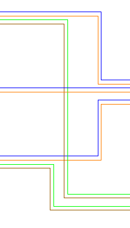
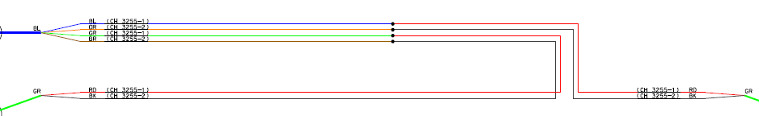
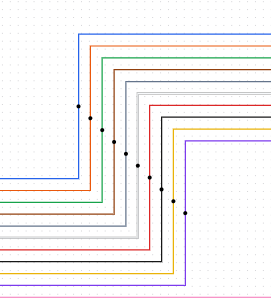
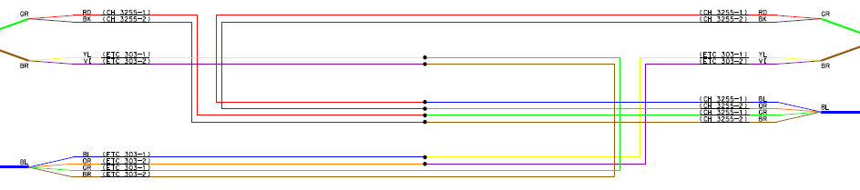
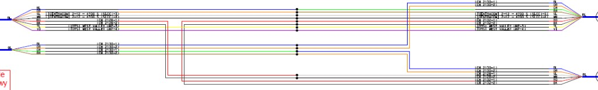
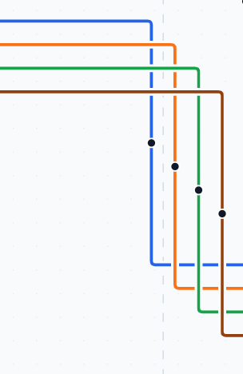
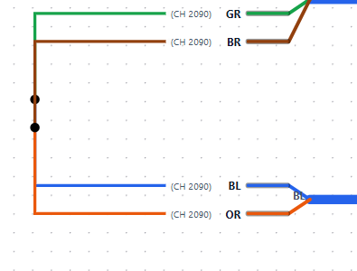

# Routing examples — annotated reference

These screenshots are the visual source of truth for the center routing rules in
[`docs/REFACTOR_PLAN.md`](../../REFACTOR_PLAN.md) section 4. Each is annotated below with the
rule(s) it demonstrates. The new deterministic router must reproduce the "good" behavior and make
the "bad" patterns structurally impossible.

## Good examples (do this)

### good-01-grouping-spacing-order.png

Fibers route together as groups until their destinations diverge, then peel off. Shows consistent
spacing between groups, clean nesting, and overall order/organization.
Rules: **R1, R3, R5, R6.**

### good-02-shared-plane-staggered-turns.png

A red and a black fiber share the same horizontal plane and route the same direction, but never
stack: each takes its own vertical lane and turns vertical (at staggered X) before the horizontal
segments would overlap. Which line turns first is unconstrained as long as the invariants hold.
Rules: **R3, R4.**

### good-03-concentric-nesting-45deg.png

A ~10-strand bundle turns a 90 degree corner as concentric parallel corners; bend points march
diagonally at 45 degrees (isotropic pitch). A separate strand sits below with a larger gap
(variable inter-bundle gap vs fixed intra-bundle pitch).
Rules: **R3, R5; spacing constants 4.2.**

### good-04-mixed-color-merge-by-destination.png

Fibers from different tubes/cables turn vertical and converge onto a new shared horizontal group
of mixed colors. A group is defined by shared path/destination, not color; members are nested by
destination fan-in order, with disorder absorbed at the merge.
Rules: **R5 (D10).**

### good-05-grouping-and-splitting.png

Full diagram: routing spreads across the entire vertical extent into stacked regions; groups form,
travel together, and split when destinations diverge. Mixed colors nested by destination.
Rules: **R1, R5.**

## Bad examples (never do this)

### bad-01-avoidable-crossings-same-direction.png

Strands continue in the same net direction (no loop-back), yet the turn order does not match the
exit order, producing avoidable crossings/overlaps. This should be a clean crossing-free concentric
two-bend step. Bend overlap is only ever potentially justified for a true loop-back (U-turn).
Violates: **R6 / forbidden pattern F1.**

### bad-02-coincident-vertical-lanes.png

Two fiber strands turn vertical onto the same X and are routed directly on top of each other,
collapsing the spacing minimum to zero. This is the primary legacy bug. The new router must assign
vertical lanes from the model so this is impossible by construction.
Violates: **R3 / forbidden pattern F2.**
